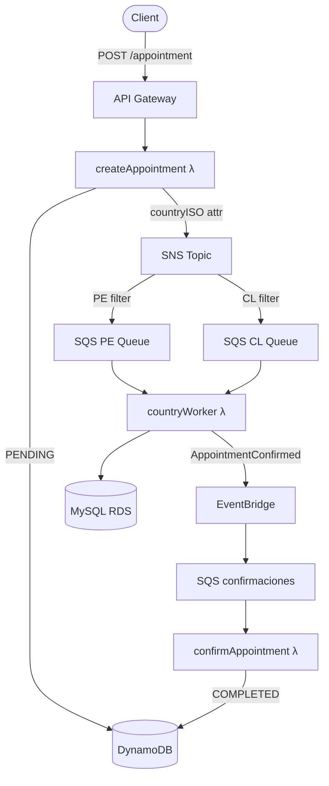

[](https://github.com/apchavez/clean-arch-aws-lambda-typescript/actions/workflows/ci.yml)
[](https://sonarcloud.io/summary/new_code?id=apchavez_clean-arch-aws-lambda-typescript)
[](https://sonarcloud.io/summary/new_code?id=apchavez_clean-arch-aws-lambda-typescript)
[](https://sonarcloud.io/summary/new_code?id=apchavez_clean-arch-aws-lambda-typescript)

# Clinic Scheduling Platform

Backend platform for medical appointment scheduling built with **TypeScript**, **AWS Serverless**, and **Clean Architecture**.

This project simulates a production-grade healthcare booking workflow using asynchronous event-driven processing, multiple data stores, and scalable cloud services.

> Designed as a portfolio project to demonstrate backend engineering skills in distributed systems, serverless architecture, and maintainable code structure.

---

## Tech Stack

| Layer | Technology |
|---|---|
| Language | TypeScript / Node.js 20 |
| Runtime | AWS Lambda (nodejs20.x, arm64) |
| API | API Gateway HTTP API |
| State store | DynamoDB |
| Relational store | MySQL 8 on RDS (per-country) |
| Messaging | SNS → SQS fan-out |
| Event bus | EventBridge |
| IaC / Deploy | Serverless Framework v4 |
| Local dev | serverless-offline, Docker |
| Testing | Jest + ts-jest |
| Docs | OpenAPI / Swagger |

---

## Architecture



> **This project uses serverless architecture on AWS Lambda. Kubernetes does not apply.**

The application follows **Clean Architecture** principles:

- **Domain layer** — Entities (`Appointment`) and port contracts (`IAppointmentStateRepo`, `IMessageBus`, `ICountryBookingRepo`)
- **Application layer** — Use cases (`AppointmentService`, `AppointmentCountryService`)
- **Infrastructure layer** — Adapters for DynamoDB, MySQL, SNS, and EventBridge — each implementing a domain port
- **API layer** — AWS Lambda handlers (thin: delegate to use cases, return HTTP responses)

### Serverless Event Flow

```text
Client
  ↓
API Gateway (HTTP API)
  ↓
createAppointment Lambda
  ↓  saves status=pending
DynamoDB
  ↓  publishes with countryISO MessageAttribute
SNS Topic (appointmentTopic)
  ↓  filtered by countryISO → PE or CL queue
SQS (appointments-pe / appointments-cl)
  ↓  country worker Lambda
MySQL RDS (country-specific DB)
  ↓  publishes AppointmentConfirmed
EventBridge (appointments-bus)
  ↓
SQS (appointments-confirmaciones)
  ↓
confirmAppointment Lambda
  ↓  updates status=completed
DynamoDB
```

Failed messages after 3 retries are routed to a Dead Letter Queue (14-day retention) per SQS queue.

---

## Project Structure

```text
src/
├── api/lambda/
│   ├── appointment.ts              HTTP handlers (create, list) + SQS confirm handler
│   ├── appointment_country.ts      Country worker (PE + CL via factory pattern)
│   └── authorizer.ts              HTTP API Lambda Authorizer — JWT validation, SSM secret cache
├── app/usecases/
│   ├── appointment.service.ts      Core booking use case
│   └── appointment-country.service.ts  Country-specific booking + confirmation use case
├── docs/
│   └── openapi.yaml                OpenAPI 3.1 contract
├── domain/
│   ├── entities/Appointment.ts
│   ├── ports/
│   │   ├── IAppointmentStateRepo.ts
│   │   ├── IConfirmationBus.ts
│   │   ├── ICountryBookingRepo.ts
│   │   └── IMessageBus.ts
│   └── types.ts                    CountryISO | Status | EventSource | Role
├── infra/
│   ├── cfn-response.ts             Shared CloudFormation custom resource response helper
│   ├── config/ddb.ts               DynamoDB document client
│   ├── jwt.ts                      HS256 JWT sign / verify (timingSafeEqual, base64url)
│   ├── tracing.ts                  captureAWSClient<T>() wrapper for AWS X-Ray SDK v3
│   ├── messaging/
│   │   ├── eventbridge.service.ts  IConfirmationBus implementation
│   │   └── sns.service.ts          IMessageBus implementation
│   ├── repos/
│   │   ├── DynamoAppointmentStateRepo.ts  IAppointmentStateRepo implementation
│   │   └── MySQLCountryBookingRepo.ts     ICountryBookingRepo implementation
│   ├── db-init.ts                  CloudFormation custom resource — creates MySQL tables
│   └── secrets-init.ts             CloudFormation custom resource — seeds SSM password
├── index.ts                        DI factories (appointmentMakeService, appointmentCountryMakeService)
└── shared/
    ├── auth.ts                     Lambda Authorizer context extractor (getAuthContext)
    ├── http.ts                     HTTP response helpers (ok / created / bad / forbidden / internal)
    └── logger.ts                   Structured JSON logger (CloudWatch-compatible)
postman/
├── clean-arch-aws-lambda-typescript.postman_collection.json
├── clean-arch-aws-lambda-typescript.local.postman_environment.json
└── clean-arch-aws-lambda-typescript.dev.postman_environment.json
tests/
├── appointment.handler.unit.test.ts
├── appointment.service.unit.test.ts
├── appointment_country.unit.test.ts
├── appointment-country.service.unit.test.ts
├── authorizer.unit.test.ts
└── jwt.unit.test.ts
```

---

## Authentication

All HTTP endpoints require a Bearer JWT token in the `Authorization` header.

```
Authorization: Bearer <token>
```

Tokens are **HS256** JWTs signed with a secret stored in SSM at `/appointments/jwt/secret`. The secret is generated automatically on first deploy by the `JwtSecretInit` CloudFormation custom resource.

### Roles

| Role | `POST /appointments` | `GET /appointments/{insuredId}` |
|------|----------------------|----------------------------------|
| `agent` | Any `insuredId` | Any `insuredId` |
| `insured` | Only their own `insuredId` (must match JWT `sub`) | Only their own `insuredId` |

Requests with a valid token but insufficient role return **403 Forbidden**.

### Generate a token (dev/testing)

```typescript
import { signJwt } from "./src/infra/jwt";

// Agent token — can operate on any insured
const agentToken = signJwt("agent-001", "agent", "<secret-from-ssm>");

// Insured token — restricted to their own insuredId
const insuredToken = signJwt("01234", "insured", "<secret-from-ssm>");

// Retrieve the secret:
// aws ssm get-parameter --name /appointments/jwt/secret --with-decryption --query Parameter.Value --output text
```

The Lambda Authorizer (`src/api/lambda/authorizer.ts`) validates the token and injects `sub` and `role` into the request context. API Gateway caches the authorizer result for 5 minutes per token.

---

## API

### Create appointment

```http
POST /appointments
Content-Type: application/json

{
  "insuredId": "12345",
  "scheduleId": 10,
  "countryISO": "PE"
}
```

**Response 201**

```json
{
  "appointmentUuid": "b3d2f1a0-...",
  "insuredId": "12345",
  "scheduleId": 10,
  "countryISO": "PE",
  "status": "pending",
  "createdAt": "2026-06-01T12:00:00.000Z",
  "updatedAt": "2026-06-01T12:00:00.000Z"
}
```

**Validation errors (400)**

| Condition | Message |
|---|---|
| Missing body | `Required body` |
| Malformed JSON | `Invalid body (JSON)` |
| Missing fields | `insuredId, scheduleId and countryISO are required` |
| `insuredId` not 5 digits | `insuredId must be 5 digits` |
| Invalid country | `countryISO must be 'PE' or 'CL'` |
| `scheduleId` non-numeric or ≤ 0 | `scheduleId must be a positive integer` |

---

### List appointments by insured

```http
GET /appointments/{insuredId}
```

**Response 200**

```json
[
  {
    "appointmentUuid": "b3d2f1a0-...",
    "insuredId": "12345",
    "scheduleId": 10,
    "countryISO": "PE",
    "status": "completed",
    "createdAt": "2026-06-01T12:00:00.000Z",
    "updatedAt": "2026-06-01T12:00:00.000Z"
  }
]
```

---

## Environment Variables

The following environment variables are injected by Serverless Framework at deploy time via CloudFormation references. No real values are hardcoded.

| Variable | Description |
|---|---|
| `TABLE_APPOINTMENTS` | DynamoDB table name |
| `SNS_APPOINTMENTS_ARN` | SNS topic ARN |
| `EB_BUS_NAME` | EventBridge bus name |
| `SQS_PE_URL` / `SQS_PE_ARN` | SQS queue for Peru |
| `SQS_CL_URL` / `SQS_CL_ARN` | SQS queue for Chile |
| `CONFIRMATIONS_SQS_URL` / `CONFIRMATIONS_SQS_ARN` | Confirmations queue |
| `RDS_PE_HOST_SSM` / `RDS_CL_HOST_SSM` | SSM parameter paths for RDS host |
| `RDS_PASSWORD_SSM` | SSM parameter path for RDS password |
| `RDS_USER` | RDS username |
| `RDS_PE_PORT` / `RDS_CL_PORT` | RDS port (default 3306) |
| `RDS_PE_DATABASE` / `RDS_CL_DATABASE` | Database names per country |

For local development with serverless-offline, copy `.env.example` to `.env` and fill in your values (`.env` is gitignored).

---

## Local Development

### Install dependencies

```bash
npm install
```

### Run locally (serverless-offline)

```bash
npm run offline
# API available at http://localhost:3000
```

The Dockerfile in the project root wraps this command for convenience:

```bash
docker build -t clinic-scheduling-platform .
docker run -p 3000:3000 clinic-scheduling-platform
```

> Docker is provided for local development only. The production deployment is serverless via AWS Lambda.

### Local Development with Localstack

Spin up local equivalents of DynamoDB, SQS, SNS, SSM, and EventBridge — plus two MySQL containers for the country workers — without needing an AWS account.

**Prerequisites:** Docker and Docker Compose.

```bash
# 1. Start Localstack + MySQL (PE on :3307, CL on :3308)
npm run localstack:up

# 2. Copy the local env file (Localstack endpoints are pre-configured)
cp .env.localstack .env

# 3. Start the API with serverless-offline
npm run offline
# API at http://localhost:3000

# 4. Stop and remove containers when done
npm run localstack:down
```

Resources created automatically by `scripts/localstack-init.sh` on Localstack startup:

| Resource | Name |
|---|---|
| DynamoDB table | `Appointments` (with GSI `byInsured`) |
| SNS topic | `appointmentTopic` |
| SQS queues | `appointments-pe`, `appointments-cl`, `appointments-confirmaciones` + 3 DLQs |
| SNS → SQS subscriptions | PE filter `countryISO=PE`, CL filter `countryISO=CL` |
| EventBridge bus | `appointments-bus` |
| SSM parameters | `/appointments/jwt/secret`, `/appointments/rds/*` |

> **Note:** X-Ray tracing is automatically disabled when `AWS_ENDPOINT_URL` points to Localstack.

### Build

```bash
npm run build
# Output: dist/
```

---

## Testing

Unit tests cover:

- Lambda handler validation, RBAC, and routing (`appointment.handler.unit.test.ts`)
- Service layer: DynamoDB writes and SNS publish (`appointment.service.unit.test.ts`)
- Country use case: booking + confirmation, error propagation (`appointment-country.service.unit.test.ts`)
- Country worker handlers: SQS processing, SNS envelope unwrap, re-throw on failure (`appointment_country.unit.test.ts`)
- Lambda Authorizer: JWT validation, SSM caching, role and expiry checks (`authorizer.unit.test.ts`)
- JWT utility: sign/verify round-trip, tamper detection, expiry enforcement (`jwt.unit.test.ts`)

```bash
npm test
```

### Coverage

```bash
npm run test:coverage
# Reports to: coverage/
```

Coverage is enforced at **80% minimum** (statements, branches, functions, lines). Infrastructure adapters that require real AWS connections (MySQL, CloudFormation custom resources) are excluded from the threshold.

---

## Postman

The `postman/` folder contains the collection and two environments.

| File | Purpose |
|---|---|
| `clean-arch-aws-lambda-typescript.postman_collection.json` | All requests with inline test scripts |
| `clean-arch-aws-lambda-typescript.local.postman_environment.json` | `baseUrl = http://localhost:3000` (serverless-offline) |
| `clean-arch-aws-lambda-typescript.dev.postman_environment.json` | `baseUrl = https://change-me.execute-api.region.amazonaws.com/dev` |

Import both the collection and the desired environment into Postman, activate the environment, then run the collection.

---

## OpenAPI

The API contract is **OpenAPI 3.1** defined in [`src/docs/openapi.yaml`](src/docs/openapi.yaml). Documents both HTTP endpoints, the `BearerAuth` JWT Bearer security scheme, and role-based access rules (`agent` vs `insured`).

**Generate static HTML doc (Redocly):**

```bash
npm run docs
# Output: docs/swagger.html — open in any browser
```

**Validate spec:**

```bash
npx redocly lint src/docs/openapi.yaml
```

---

## Deploy

### Prerequisites

1. Configure your AWS credentials (`aws configure` or environment variables).
2. Set the VPC and subnet IDs for the RDS instances as environment variables:

```bash
export RDS_VPC_ID=vpc-xxxxxxxxxxxxxxx
export RDS_SUBNET_1=subnet-xxxxxxxxxxxxxxx
export RDS_SUBNET_2=subnet-xxxxxxxxxxxxxxx
```

These are read by `serverless.yml` at deploy time via `${env:RDS_VPC_ID}`. No real IDs are committed to the repository.

### Deploy stack

```bash
npx serverless deploy
```

### Remove stack

```bash
npx serverless remove
```

> `deploy.yml` deploys automatically to `dev`/`us-east-1` whenever `CI` completes successfully on `main`. It can also be triggered manually via `workflow_dispatch` with a chosen `stage` (dev/staging/prod) and `region`. Required secrets: `AWS_ACCESS_KEY_ID`, `AWS_SECRET_ACCESS_KEY`.

---

## Logs

```bash
npx serverless logs -f createAppointment -t
npx serverless logs -f appointmentPE -t
npx serverless logs -f appointmentCL -t
npx serverless logs -f confirmAppointment -t
```

---

## CI/CD

CI runs on every push and pull request to `main`.

Pipeline: `install → lint → build → test → coverage`

No AWS credentials are required. No automatic deploy is performed.

See `.github/workflows/ci.yml`.

---

## What This Project Demonstrates

- Clean Architecture with dependency inversion (ports & adapters) — domain layer has zero infrastructure dependencies
- Event-driven systems with SNS fan-out → SQS per country (filter by `countryISO` MessageAttribute)
- Multi-database design: DynamoDB for state tracking, MySQL for relational persistence per country
- Parameterized Lambda handlers via factory pattern to eliminate code duplication
- Dead Letter Queues (14-day retention) for all SQS queues — reliability by design
- Structured JSON logging compatible with CloudWatch Logs Insights
- Consistent input validation (format + type) aligned with the OpenAPI contract
- 500 error handling at the Lambda boundary — unhandled exceptions never bubble as uncaught rejections
- Typed Lambda events (`APIGatewayProxyEvent`, `SQSEvent`, `CloudFormationCustomResourceEvent`)
- AWS Serverless Framework with CloudFormation custom resources for DB and secrets bootstrap
- JWT Bearer auth via HTTP API Lambda Authorizer — HS256, `timingSafeEqual`, SSM-backed secret, 300 s result cache
- Unit testing with mocked AWS SDK clients (`aws-sdk-client-mock`) and plain interface mocks
- Jest coverage enforcement at 80% threshold across 47 tests in 6 suites

---

## Observability

### Logging

All Lambda functions emit structured JSON logs to stdout, which CloudWatch Logs captures automatically. Each log entry includes `timestamp`, `level`, `message`, and arbitrary context fields. Pass `{ requestId: context.awsRequestId }` to correlate log entries with X-Ray trace IDs:

```typescript
logger.info('appointment created', { requestId: ctx.awsRequestId, appointmentUuid });
```

### Distributed Tracing (X-Ray)

Active tracing is enabled on all Lambda functions and API Gateway (`tracing: lambda: true / apiGateway: true` in `serverless.yml`). AWS X-Ray captures:

- Cold start vs warm invocation duration per function
- API Gateway → Lambda segments automatically
- AWS SDK calls instrumented via `captureAWSClient()` in `src/infra/tracing.ts`

The IAM role includes `xray:PutTraceSegments` and `xray:PutTelemetryRecords` permissions. Traces are visible in the AWS X-Ray console and can be queried via CloudWatch ServiceLens.

### CloudWatch Alarms

Three **CloudWatch Alarms** fire whenever any Dead Letter Queue accumulates at least one message, signaling a processing failure that needs investigation:

| Alarm | DLQ | Indicates |
|-------|-----|-----------|
| `clinic-scheduling-platform-pe-dlq-depth` | `appointments-pe-dlq` | Country worker failed to book appointment in Peru RDS |
| `clinic-scheduling-platform-cl-dlq-depth` | `appointments-cl-dlq` | Country worker failed to book appointment in Chile RDS |
| `clinic-scheduling-platform-confirmations-dlq-depth` | `appointments-confirmaciones-dlq` | Confirm Lambda failed to update DynamoDB status |

Alarms publish to an SNS topic (`clinic-scheduling-platform-alarms`) deployed with the stack. To receive email notifications, set `ALARM_EMAIL` before deploying:

```bash
export ALARM_EMAIL=your@email.com
npx serverless deploy
```

The SNS topic ARN is exported as a CloudFormation output (`clinic-scheduling-platform-alarms-topic-arn`) so downstream stacks or CI pipelines can add additional subscribers.

---

## Related Projects

| Project | Description |
|---|---|
| [clean-arch-azure-functions-java](https://github.com/apchavez/clean-arch-azure-functions-java) | Azure migration of this platform — same domain and Clean Architecture, rewritten in Java 21 on Azure Functions, Cosmos DB, and Service Bus |
| [serverless-api-integration-aws](https://github.com/apchavez/serverless-api-integration-aws) | Serverless integration service on the same TypeScript / AWS Lambda / DynamoDB stack |
